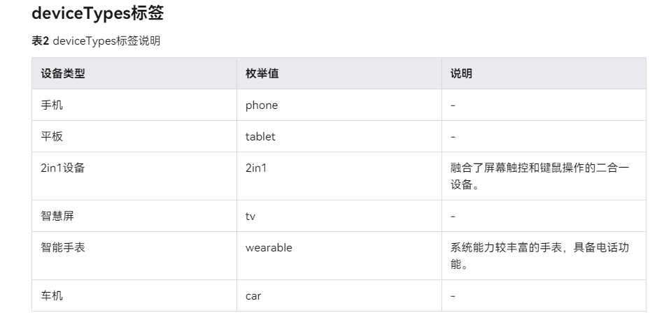

**当前适配版本为 5.0.0(12)**
## 环境

- DevEco Studio 5.0.0 Release
    - Build Version: 5.0.3.906
- Harmony OS Api 5.0.0(12)
- hvigor 5.0.0


### 工程目录

   ```
   products                                       # 产品定制层，作为不同设备或场景应用入口，例如phone、tv等
   |---phone                                      // 手机
   ```

## 产品层目录参考



## 开源协议
本项目基于 [Apache License](https://gitee.com/jiaojiaoone/explore-harmony-next/blob/master/LICENSE.txt) ，请自由地享受和参与开源。

## 源码

- gitee：https://gitee.com/jiaojiaoone/explore-harmony-next.git
- github：https://github.com/JasonYinH/ExploreHarmonyNext.git

## 交流

使用有疑问或建议， **请提交issue（这样可以统一收集问题，方便更多人查阅，另外会也第一时间回复处理）** ，或者(+v: yinshiyuba)。
